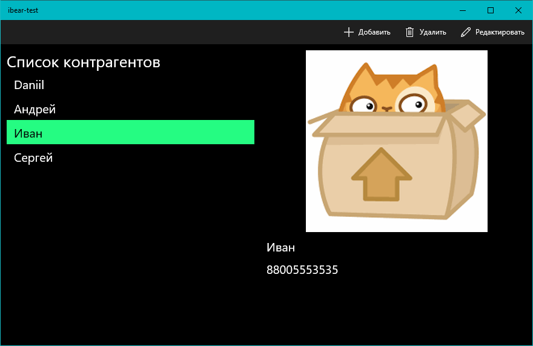

# Работа с контаргентами
* При создании БД инициализируется несколькими записями без аватаров, отображается placeholder
* Для тестирования работы с изображениями в папке Assets находятся файлы с разными соотношениями сторон и размерами
* Помимо требуемых полей с именем, фото, почтой и номером, добавлены вспомогательные поля для хранения размеров аватара
* Содержимое TextBox при вводе проверяется с помощью TextBoxRegex
* Есть возможность вернуться на главную страницу без применения изменений
* Добавлено подтверждение при удалении
* Содержимое TextBlock на главной странице копируется в буфер при нажатии
* Фото при добавлении сокращается до размеров Image (300x300) с сохранением соотношений сторон и в таком виде сохраняется в SQLite

